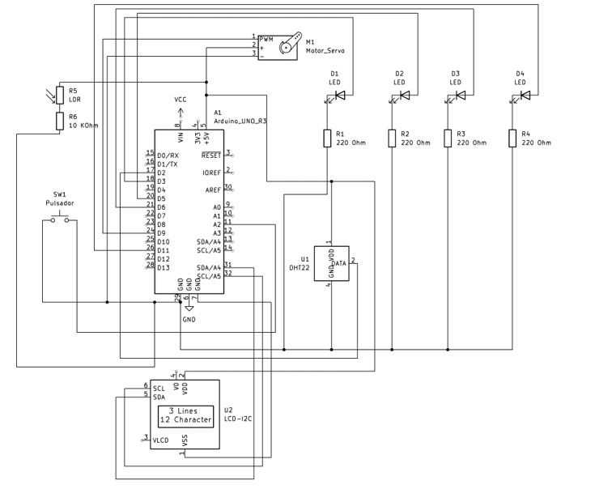

# Actividad 2 - Sistema de control y actuación en función del clima
- **Asignatura**: Electrónica e Instrumentación Básicas
- ***Alumnos***:
  - Javier Gutiérrez Rodríguez
  - David Viñuela Reyes
  - Javier Sánchez Redondo
    
 *Máster Universitario en Ingeniería de Telecomunicación*

 ## Introducción al sistema de control y actuación en función del clima

 ## Diseño del sistema

 ### Hardware
 #### Diagrama de conexiones
 

 #### Bill of Materials
 [📄 Componentes.csv](BOM.csv)
 ### Software

## Conclusiones

## Licencia
